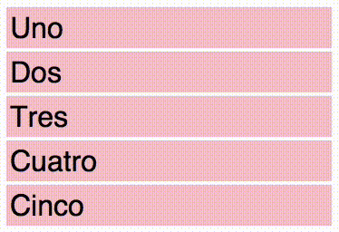

# Ember-sortable

Sortable UI primitives for Ember.



## Installation

```sh
$ ember install ember-sortable
```

## Usage

```hbs
{{#sortable-group tagName="ul" onChange="reorderItems" as |group|}}
  {{#each model.items as |item|}}
    {{#sortable-item tagName="li" model=item group=group}}
      {{item.name}}
    {{/sortable-item}}
  {{/each}}
{{/sortable-group}}
```

The source model is *not* mutated. Instead the `onChange` action handler
receives a fresh array of items in the new order:

```js
actions: {
  reorderItems(newOrder) {
    this.set('currentModel.items', newOrder);
  }
}
```

## Developing

```sh
$ git clone git@github.com:jgwhite/ember-sortable
$ cd ember-sortable
$ ember install
$ ember server
```

### Running Tests

```sh
$ ember test
```

### Building and publishing the demo

```sh
$ make demo
```
